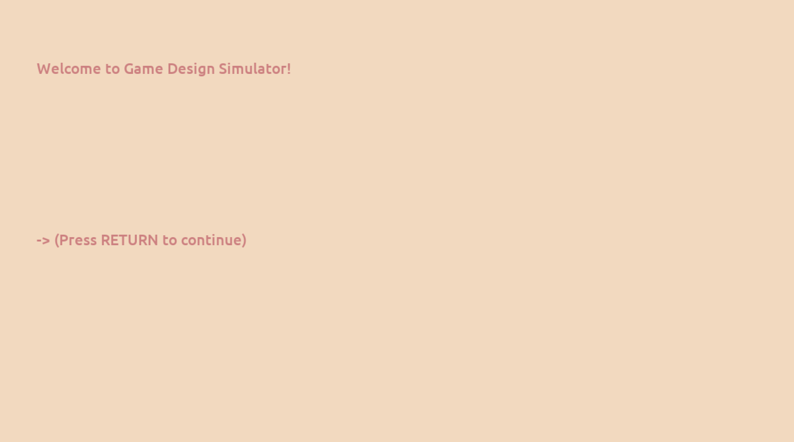

# Game Design Simulator

**Author**: Joanna Yao

**Design**: Game design simulator where you are designing the exact game that you are playing

**Text Drawing**: Text is rendered at runtime where each codepoint is shaped by Harfbuzz. The corresponding glyph is either read directly from the cache or loaded with Freetype (then cached). Finally, OpenGL handles the drawing.

**Choices**: The game store choices in a nested hash map (authored directly in the game code), where each entry is a game state and different options lead to different new states

**Screen Shot**:

**How To Play**: UP and DOWN to select options, RETURN to confirm selection, R to revert to previous state

**Sources**: font: [Ubuntu](https://fonts.google.com/specimen/Ubuntu)

This game was built with [NEST](NEST.md).

